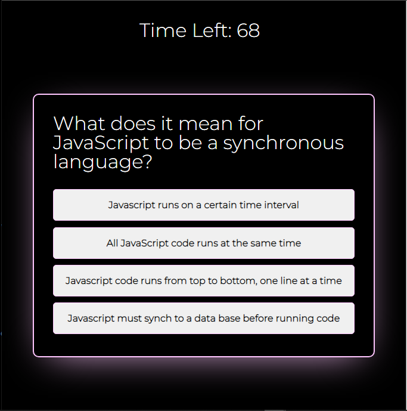
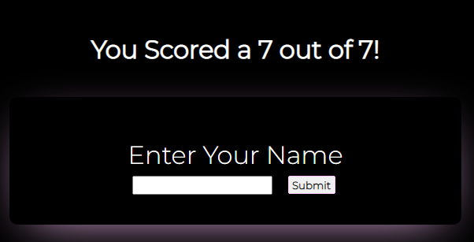
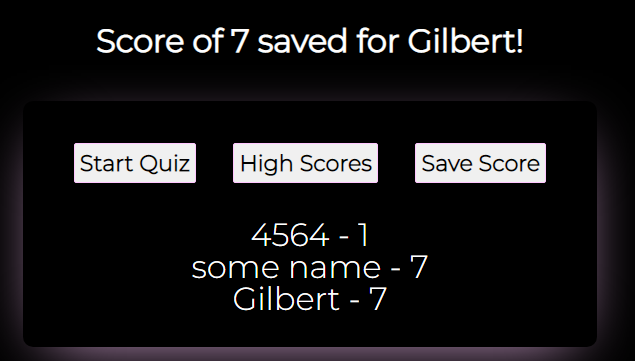

# Coding-Assessment-App

Welcome to my [Quiz App](https://cagatin.github.io/Coding-Assessment-App/)!

## What does this do?
This quiz enables the user to answer questions relating to web development in a 90 second time period. If the user answers correctly, a point will be added to the user's score. If incorrect, 10 seconds will be deducted from the time.  

### When does the game end?
The game ends when either:  
A) The player answers every possible question  
B) The timer hits 0  

### High Scores
  
Once the game  has ended, the user can select whether or not to save their score onto the high scores board. If so, the player's name and score will be saved within the local storage to display high scores on further quizzes. 
 

  
The user also has the option to select the high scores button in order to display previously saved high scores. 